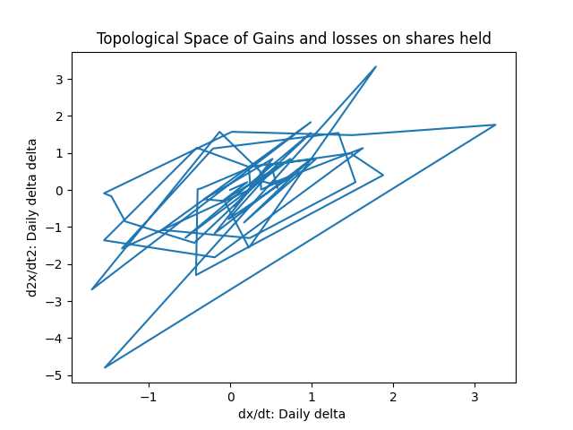
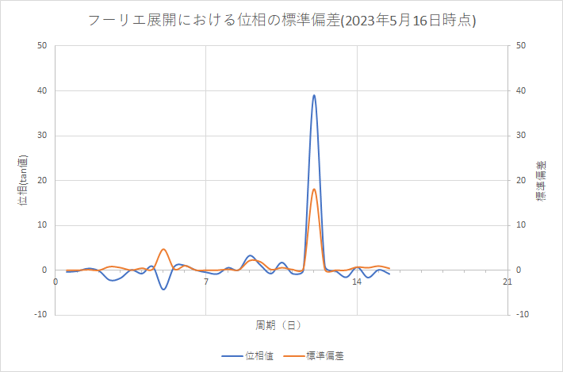

# Fourier Expansion
Fourier expansion from data in csv file

monex-fourier.py: 現時点、マネック証券専用ですが、損益率の時系列を、フーリエ展開するpythonスクリプトを作ってみました。元データは、マネック証券のサイトで、口座全体の資産推移のページから、時系列のCSVファイルをダウンロードして、そのファイル名に置き換えて、実行すると、フーリエ展開結果が、csvファイルとして出力されます。

---

(コマンドラインからの起動例)

python monex-fourier.py view_20230513_xxxxxx.csv

---
[実行例]

(入力データ) view_20230513_xxxxxx.csv

---

(出力結果１) view_20230513_xxxxxx-fourier.csv

(出力結果２) view_20230513_xxxxxx-topological.png

---

monex-phase-analysis.py: 上記の出力ファイルの複数から、位相の平均と標準偏差を求めるスクリプト。

python monex-phase-analysis.py view_20230509_xxxxxx-fourier.csv view_20230510_xxxxxx-fourier.csv view_20230511_xxxxxx-fourier.csv view_20230512_xxxxxx-fourier.csv ...

実行結果の例(EXCELでグラフ表示)

---

[適用例]

* https://note.com/digiponta/m/m4549d2a07d5a

以上
