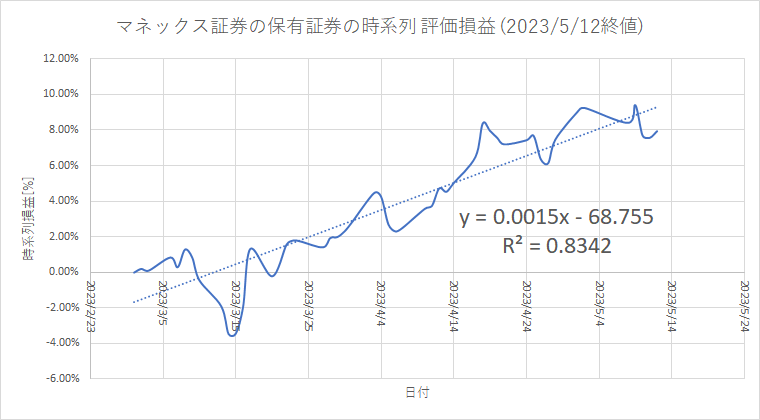
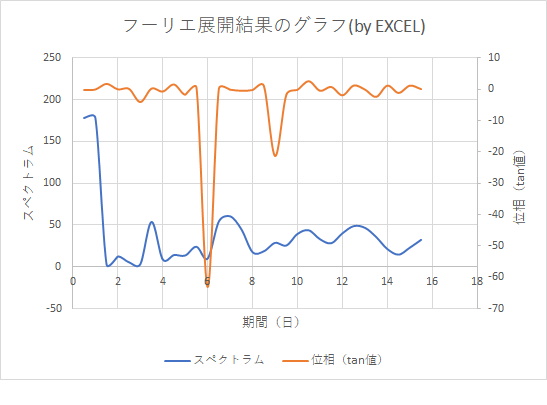

# Fourier Expansion
Fourier expansion from data in csv file

monex-fourier.py
現時点、マネック証券専用ですが、損益率の時系列を、フーリエ展開するpythonスクリプトを作ってみました。元データは、マネック証券のサイトで、口座全体の資産推移のページから、時系列のCSVファイルをダウンロードして、そのファイル名に置き換えて、実行すると、フーリエ展開結果が、csvファイルとして出力されます。

---
[実行例]

(入力データ)

(出力結果)

以上
